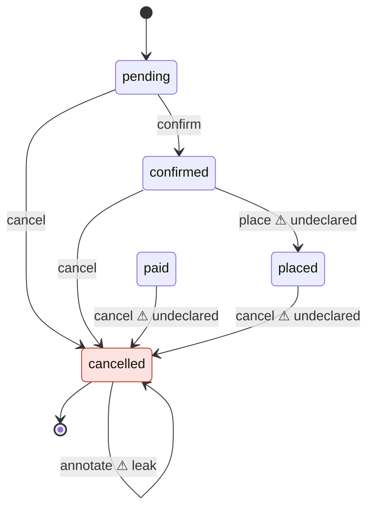

# domain-integrity

[](https://www.npmjs.com/package/domain-integrity)
[](https://github.com/mannkostir/domain-integrity/actions/workflows/ci.yml)
[](LICENSE)

**Your aggregates have lifecycles. Nothing checks them.**

Your tests pass and your types check, yet a closed account still accepts deposits and a cancelled order can still be edited. Lifecycle rules live in people's heads, and every new method, whether you or a coding agent wrote it, can quietly break one.

`domain-integrity` reads your aggregates with the TypeScript type checker. It works out which states each method can actually run from, compares that with a three-line declaration of what you intended, and fails CI where the two disagree.

It also follows in-process domain events. It finds the handlers registered for each event class and reports the ones that can never run, the ones that do not match their event, events nobody handles, and sagas with no failure path.

## See it catch a bug

A typical aggregate. Once an account is closed, nothing should happen to it, but nothing enforces that:

```ts
import { AggregateRoot } from './aggregate-root';

export class Account extends AggregateRoot<{ balance: number }> {
  private closedAt: Date | null = null;
  private lockedAt: Date | null = null;

  static open(): Account {
    return new Account({ balance: 0 });
  }

  deposit(amount: number): void {
    if (amount < 1) throw new Error('Amount must be positive');
    this.props.balance += amount;
  }

  withdraw(amount: number): void {
    if (this.props.balance < amount) throw new Error('Insufficient funds');
    this.props.balance -= amount;
  }

  lock(): void {
    if (this.lockedAt) throw new Error('Already locked');
    this.lockedAt = new Date();
  }

  close(): void {
    if (this.props.balance > 0) throw new Error('Balance remains');
    this.closedAt = new Date();
  }
}
```

Write the rule down once:

```ts
import { defineDomain, lifecycle } from 'domain-integrity';
import { Account } from './src/account';

export default defineDomain({
  lifecycles: [lifecycle(Account, { states: { closedAt: { terminal: 'set' } } })],
});
```

Run `npx domain-integrity check`:

```text
error terminal-state-leak  Account.deposit()  src/account.ts:11
  deposit() can run after closedAt is 'set'.
  Fix: Guard deposit() so it cannot run when closedAt is 'set', or list it in allowAfterTerminal if that is intended.

error terminal-state-leak  Account.withdraw()  src/account.ts:16
  withdraw() can run after closedAt is 'set'.
  Fix: Guard withdraw() so it cannot run when closedAt is 'set', or list it in allowAfterTerminal if that is intended.

error terminal-state-leak  Account.lock()  src/account.ts:21
  lock() can run after closedAt is 'set'.
  Fix: Guard lock() so it cannot run when closedAt is 'set', or list it in allowAfterTerminal if that is intended.

error terminal-state-leak  Account.close()  src/account.ts:26
  close() can run after closedAt is 'set'.
  Fix: Guard close() so it cannot run when closedAt is 'set', or list it in allowAfterTerminal if that is intended.

4 errors, 0 warnings
```

Every method still runs on a closed account, including `close()` itself. The exit code is `1`, so CI fails.

## See the lifecycle

`npx domain-integrity show` draws each aggregate's real state machine as Mermaid, which renders directly on GitHub. Here is an `Order` whose declaration says `place` runs from `paid` and `cancel` runs only from `pending` or `confirmed`:



The picture shows four bugs:
- **`paid` is unreachable.** No code ever sets it.
- **`place` skips payment.** It runs straight from `confirmed`.
- **`cancel` runs too late.** It still works after the order is paid or placed.
- **`annotate` leaks past the end.** It still changes a cancelled order.

`check` reports each of them, with a fix.

## Quick start

```bash
npm i -D domain-integrity
npx domain-integrity init
npx domain-integrity check
```

`init` finds your aggregates and suggests their state fields and terminal values. It writes `domain.config.ts` with real imports, so renaming an enum member makes `check` fail instead of silently drifting. You review the suggestions once; after that, `check` runs on every commit.

**Requirements:** Node 20+, a TypeScript 5+ project, and `strictNullChecks` for nullable state fields.

## What it checks

| Check | Catches |
|---|---|
| `terminal-state-leak` | A public method that can still change the aggregate after it reached a terminal state |
| `unreachable-state` | A state your type declares but no code ever assigns |
| `outside-mutation` | State assigned from outside the aggregate, for example from a service, mapper or specification. A write through the aggregate's own setter is not one. |
| `transition-drift` | A method that can run from states you did not declare (error), or no longer from states you did (warning) |

Four more checks cover in-process event flows. All of them are errors:

| Check | Catches |
|---|---|
| `dead-handler` | A handler is registered for an event class that production code never constructs |
| `handler-payload-mismatch` | A handler is registered for one event class but declares its event as an unrelated class |
| `unhandled-event` | A declared in-process event is constructed but has no handler |
| `saga-missing-failure-path` | A saga handles the success event of a declared outcome but not its failure event |

`dead-handler` and `handler-payload-mismatch` always run. `unhandled-event` runs only for the classes listed in `events.inProcess`, and `saga-missing-failure-path` only for sagas declared with `saga()`. See "The declaration".

These shapes are recognised as handlers:
- a configured decorator on a class, where the `handle` method is the handler and its first parameter is the event, or on a method;
- `register(callback, X)` or `register(callback, X.name)`, where the callback is `this.m`, `this.m.bind(this)` or an inline function;
- `subscribedTo()` returning an array literal, such as `[X, Y]`;
- a `@Saga()` property that uses `ofType(X, …)`.

A project with event handlers and no aggregates is accepted. When it has neither aggregates nor event flows, every command exits `2` with the "No aggregates found" message.

Only public methods are judged. Private and protected helpers, such as event-sourcing appliers, are covered by the public command that calls them.

Every file your tsconfig includes is scanned, tests too, so an assignment in a test is reported as `outside-mutation`. To leave tests out, give `check` a tsconfig that excludes them:

```json
{
  "extends": "./tsconfig.json",
  "exclude": ["node_modules", "test", "**/*.spec.ts", "**/*.test.ts"]
}
```

```bash
npx domain-integrity check -p tsconfig.domain.json
```

## Commands

| Command | What it does |
|---|---|
| `init [--yes]` | Suggests and writes declarations. On an existing config it only adds new aggregates. |
| `check [--format text\|json\|sarif]` | Reports findings. Exit `0` clean, `1` findings, `2` config, project or usage error. |
| `show [name]` | Prints Mermaid state diagrams, then an event-flow flowchart. Takes an aggregate class name, an event name, or `path:Class` such as `src/orders/order.ts:Order`, with the path relative to the tsconfig directory; `./` prefixes and backslashes are accepted. When several aggregates share the class name, a plain name exits `2` and lists the `path:Class` candidates. |
| `context [--write AGENTS.md]` | Writes a summary of lifecycles and event flows for coding agents. |

Every command takes `-p <tsconfig>` and `-c <config>`, which default to `tsconfig.json` and `domain.config.ts`. The config is read statically and never executed.

## Built for codebases that agents write

Agents produce code that passes tests and still breaks the domain. Give them the rules before they write:

```bash
npx domain-integrity context --write AGENTS.md
```

This writes each aggregate's states, terminal values and allowed transitions, plus an "Event flows" section, into a marked section of `AGENTS.md`, or `CLAUDE.md`, and leaves the rest of the file untouched. The agent reads the rules up front, and `check` catches whatever slips through.

## Adopt it in an existing codebase

You don't have to fix everything first. Record today's findings and fail only on new ones:

```bash
npx domain-integrity check --update-baseline
npx domain-integrity check --baseline domain-integrity.baseline.json
```

Baseline entries for lifecycle findings are keyed by check, aggregate, method and field, not by line number, so unrelated edits don't break the baseline.

Each entry has the form `check|aggregate|method|field|subject`. The aggregate is its class name. When several aggregate classes share a class name, whether or not they are declared, each of them is written as `path:Class` instead, with the path relative to the tsconfig directory, for example `terminal-state-leak|src/orders/order.ts:Order|annotate|status|CANCELLED`. An undeclared class counts too, such as a test double that extends your aggregate base class inside the tsconfig `include`. The JSON output carries the same identifier in `aggregateId`, next to the plain class name in `aggregate`. Adding such a class changes the existing aggregate's keys, and its known findings come back as new until you run `--update-baseline` again.

Event-flow findings have the key `checkId|eventId|handler|subject`. Every JSON finding carries `analyzer`, either `lifecycle` or `event-flow`. Event-flow findings use `event`, `eventId` and `handler` in place of the aggregate fields.

## CI

```yaml
name: domain-integrity
on:
  push:
    branches: [main]
  pull_request:
permissions:
  contents: read
  security-events: write
jobs:
  lifecycles:
    runs-on: ubuntu-latest
    steps:
      - uses: actions/checkout@v4
      - uses: actions/setup-node@v4
        with:
          node-version: 20
      - run: npm ci
      - uses: mannkostir/domain-integrity@v0
        with:
          baseline: domain-integrity.baseline.json
```

Findings appear as code-scanning alerts on the pull request, and the job fails when `check` does.

| Input | Default | Meaning |
| --- | --- | --- |
| `project` | `tsconfig.json` | path to the project's `tsconfig.json` |
| `config` | `domain.config.ts` | path to the declaration |
| `baseline` | none | baseline file to apply |
| `upload` | `true` | upload the SARIF report to code scanning; set `false` when code scanning is unavailable |

The step exposes `exit-code`, the exit code of `check`, and `sarif-file`, the path to the SARIF report.

## The declaration

```ts
import { defineDomain, lifecycle } from 'domain-integrity';
import { OrderEntity } from './src/ordering/domain/order.entity';
import { OrderStatus } from './src/ordering/domain/order-status';
import { Account } from './src/accounts/domain/account';

export default defineDomain({
  aggregateBaseClasses: ['AggregateRoot'],
  lifecycles: [
    lifecycle(OrderEntity, {
      states: {
        status: {
          terminal: [OrderStatus.cancelled],
          transitions: {
            confirm: [OrderStatus.pending],
            cancel: [OrderStatus.pending, OrderStatus.confirmed],
          },
        },
      },
      allowAfterTerminal: ['remove'],
    }),
    lifecycle(Account, {
      states: {
        closedAt: { terminal: 'set' },
        lockedAt: { terminal: 'set', allowAfterTerminal: ['close'] },
      },
    }),
  ],
});
```

Event flows go in an `events` block. It is optional, and handlers are found without it:

```ts
import { defineDomain, saga } from 'domain-integrity';
import { InvoiceSent, PaymentCaptured, PaymentFailed, Shipped } from './src/events';
import { OrderSaga } from './src/saga';

export default defineDomain({
  events: {
    inProcess: [Shipped, InvoiceSent],
    sagas: [saga(OrderSaga, { outcomes: [[PaymentCaptured, PaymentFailed]] })],
  },
});
```

| Option | Meaning |
|---|---|
| `events.handlerDecorators` | Decorator names that mark a handler. Default: `['EventsHandler', 'OnEvent']`. |
| `events.registerMethods` | Method names whose calls register a handler. Default: `['register']`. |
| `events.inProcess` | Event classes that are dispatched inside the process. `unhandled-event` runs only for these. |
| `events.sagas` | `saga(Target, { outcomes: [[Success, Failure]] })`. `saga-missing-failure-path` runs only for these. |

An outcome that lists one class as both success and failure exits `2`. So does a declared class outside the analysed files, or a saga that handles neither side of an outcome; the last two are reported as `problem:` lines.

Each lifecycle takes these options:

| Option | Meaning |
|---|---|
| `states` | The aggregate's state fields. Supported: enum, string-literal union, boolean, and nullable (`T \| null` or optional; use `'set'` and `'unset'`). Name the data field itself, e.g. `_status` rather than its getter. |
| `terminal` | Required. The values after which the aggregate must not change. |
| `transitions` | Optional. The states each method may run from. Method names are type-checked; values are validated when `check` runs. |
| `allowAfterTerminal` | Optional. Methods allowed on a finished aggregate, such as `remove`. Next to `states` it exempts a method for every state field; inside a state field, such as `lockedAt` above, only for that field, so `close()` may run on a locked account but is still judged after `closedAt` is set. The two lists combine. Method names are type-checked. |
| `aggregateBaseClasses` | Base classes or interfaces that mark an aggregate: a class that extends or implements one, directly or through its base classes and interfaces. Abstract classes are skipped. Method collection also stops at a listed name: if it names a project class in the middle of an aggregate's inheritance chain, that class's methods and those above it are not analysed, so pick interface names that do not clash with your project's base classes. Default: `['AggregateRoot', 'Entity']`. |
| `auditFields` | Fields `init` never suggests. Default: `['createdAt', 'updatedAt', 'version']`. |
| `eventMethods` | Calls that emit domain events. Default: `['addEvent', 'addDomainEvent', 'apply']`. |
| `inertEventMethods` | Event methods you assert never read aggregate state, such as an `addDomainEvent` that also registers `this` in a static `DomainEvents` registry or logs it. Every entry must also be in `eventMethods`, or `check` exits with code 2. The assertion covers every method of that name in the project, including overrides in subclasses. A listed method's body is not traced, and `this.addDomainEvent(new UserLoggedIn(this))` and `super.addDomainEvent(new UserLoggedIn(this))` count as event handoffs. The assertion holds only while every declaration of the name is a method, no project class declares a non-method instance member of that name, nothing in the project writes it, every base type in the aggregate's heritage resolves, and no class in the aggregate's family or class expression anywhere in the project is decorated or calls `Object.assign(this, …)`; see "Asserted event methods". A wrong entry for an event method that reads the state field, or calls code that does, can produce a false finding. Default: `[]`. |
| `inertMembers` | Library getters, methods and properties that never read aggregate state, such as `id` or `clearDomainEvents`. A listed name counts as not reading the state field unless a `.ts` file in your project declares a member of that name; a `super.` call to it counts only the declarations above the class that makes the call; declarations in `.d.ts` files, including your own, count as library code. List only members whose library code never reads aggregate state and never calls back into your overrides: a wrong entry turns a guard through that member into no guard and can produce a false finding. Default: `[]`. |

## Quiet by design

A lint rule that cries wolf gets switched off. `domain-integrity` reports only what it can prove, and stays silent on code it cannot follow. In practice it says nothing about:

- **Guards it can't follow.** Examples are rule or policy objects, conditions on local copies of the state, and abstract or library methods. That method is skipped for that field.
- **Methods that hand out `this`.** That covers fluent `return this`, passing the aggregate to a constructor, and aliasing or destructuring it. The one exception is a plain event handed straight to a library event method, such as `this.apply(new OrderPaid(this))`, or to a project event method that only pushes onto a private event array or is listed in `inertEventMethods`; see the precise rules.
- **Object fields in aggregates that leak `this` anywhere.** Methods that read those fields are skipped, because a field might hold a callback into the aggregate.
- **Library base-class members**, other than the configured `eventMethods` and `inertMembers`, because library code can call back into your overrides. A method that reads a library getter such as `this.id` or calls `this.clearDomainEvents()` is skipped until you list that member in `inertMembers`.
- **Values mentioned elsewhere.** `unreachable-state` stays quiet about a value that appears anywhere outside comparisons and types.
- **Writes through the aggregate's own setters.** `order.status = x` or `Object.assign(order, { status })` is not an outside mutation when `status` is a setter on the aggregate or one of its project base classes, because the setter is the aggregate's own code. A write through a setter declared only in library code is still reported as `outside-mutation`. The value still counts as assigned for `unreachable-state`. Setters themselves are not judged, so a setter without a guard goes unreported.
- **Database writes.** State changed by `UPDATE` statements or query builders is invisible.

The analysis also trusts that nothing tampers with a plain event array from outside the aggregate's family. It does not see:

- a replaced `Array.prototype.push`, or a replaced `push` on a single array;
- writes that bypass type checking or reach the field through reflection or untyped access, such as `(agg as any)._events = …`, `Reflect.set`, `Object.defineProperty` with a string key, `Object.assign(agg, …)` on another reference, or a computed-key write through an alias such as `const self = this; self[key] = …`;
- `Object.assign(this, …)` reached under another name or indirectly, such as `const put = Object.assign; put(this, …)`, `const { assign: put } = Object; put(this, …)`, `Object.assign.call(Object, this, …)` or `Reflect.apply(Object.assign, Object, [this, …])`;
- for an `inertEventMethods` entry, writes that bypass type checking or visible syntax, such as `(agg as any)[k] = …` with a computed non-literal key outside the aggregate's family, `Reflect.set`, `Object.defineProperty(X.prototype, 'addDomainEvent', …)`, `Object.assign(X.prototype, { addDomainEvent })`, `Object.assign` onto `this` reached under another name, `Object.setPrototypeOf` on a class or prototype in the aggregate's chain, or patched built-ins;
- a project subclass of the aggregate that overrides the event method, or an instance reassignment of it such as `this.addDomainEvent = …` in a constructor, because `this.` calls are resolved on the declared aggregate class, as for every other member.

A few rare self-wiring shapes can still produce a false finding: a factory or service outside the class (`agg.policy = new Policy(agg)`), the instance held inside another object (`box.o.policy.owner = box.o`), and a module-level factory function. So can a non-callable library property, such as a `boolean`, that a `.d.ts` declares as plain data while its JavaScript implements it as a getter reading the state field, for example through one of your overrides. The property is trusted as written, so a guard through it reads as no guard and the method can be reported as a `terminal-state-leak` or `transition-drift`. Current TypeScript emits accessors as accessors in `.d.ts` files, so this needs an older or hand-written declaration. An `inertMembers` entry for a library member that does read the state field can too. So can an `inertEventMethods` entry for an event method that reads the state field or calls code that does. If it flags something that is not a bug, please [open an issue](https://github.com/mannkostir/domain-integrity/issues).

The event-flow analyzer reports nothing for these:

- **String and wildcard topics**, and dispatch on `constructor.name`.
- **Handlers keyed on an interface or a base type** through shapes it does not recognise.
- **Transports that cross the process.** Brokers, outboxes and event stores cannot be followed.
- **Events constructed only outside the analysed files, or only in test files.** Test files are `*.spec.*`, `*.test.*` and anything under `__tests__/`, `test/` or `tests/`.
- **Getter-declared handlers**, such as `get event()`.
- **Events raised into an aggregate buffer that is never dispatched.**
- **Sagas whose class extends a library class or a mixin call.** A saga is also skipped when a handler registration inside it or one of its project base classes cannot be resolved.

Some code keeps a rule silent:
- `unhandled-event` is silent for the whole project when any handler registration cannot be resolved. That covers an unrecognised `register` call, a configured decorator whose arguments are not plain class references (a string topic, for example), a `subscribedTo()` that does not return an array literal of classes, and a `@Saga()` property without a resolvable `ofType(...)`. For one event class `X` it is also silent on an `instanceof X`, a string equal to `X`'s name, a parameter typed `X`, or `X` used as a value other than `new X`, a registration key or `instanceof`.
- `dead-handler` is silent for `X` when `X` is abstract, is subclassed, or is used as a value other than `new X`, a registration key or `instanceof`. A factory map, passing `X` to a function, and `X<T>` as a value all count.

<details>
<summary>The precise rules</summary>

- **Guards.** A guard counts only if it is an early return or throw, or an `if` that wraps the whole method, with conditions built from `===`, `!==`, `==`, `!=`, truthiness, `&&`, `||`, `!`, and getters that return such a condition. For a nullable field whose type includes both `null` and `undefined`, such as `T | null | undefined` or an optional `x?: T | null`, a strict `=== null` or `=== undefined` covers only that one; a guard must cover both, for example `== null`, truthiness, or both strict checks, or the method's allowed sources stay unknown. A truthy check on a nullable field always means `set`. A falsy check means unset only when no non-null member of the field's type can be falsy, that is, every member is an object type, such as `Date`, a class, an array or a function, that `''`, `0`, `0n` and `false` are not assignable to. For any other type, such as `number`, `string`, `bigint`, a branded `string & { … }`, `{}`, `{ length: number }` or a type parameter, `0`, `''`, `0n` or `false` may be a set value, so a falsy check does not exclude `set`: `if (this.count) return` still lets the method run from `set`, while `if (!this.count) return` still limits it to `set`. Any other read of the state field in the method makes its allowed sources unknown. Unknown never produces a finding. After the method's first top-level plain `=` assignment to the field itself, through plain data members declared in your project rather than a setter or a getter-returned copy, later reads and guards of the field are ignored, because by then it holds the assigned value; reads before it, including the assignment's right-hand side, still count.
- **Members without a body.** A member with no body in the project counts as reading the state field. That includes abstract members, members declared only in `.d.ts` files, and members of base classes that cannot be resolved. There are four exceptions:
  - configured `eventMethods`, which are assumed not to read it when every declaration of the name across the aggregate and its base classes is library code, or there is none. Declarations in `.d.ts` files, including your own, count as library code. An event method that a `.ts` file in your project declares without a body that can be traced, for example in a mixin or as an abstract method, counts as reading it, so its callers are not judged, unless the name is listed in `inertEventMethods`. A `super.` call is judged by the declarations above the class that makes it, so `super.apply(event)` in your override that reaches only a library declaration is still assumed not to read it;
  - configured `inertMembers`, which are assumed not to read it, whether the library declares them as getters, methods or data properties. A member that a `.ts` file in your project declares, such as an override of a listed getter, is still traced, and a `super.` call inside it, such as `super.clearDomainEvents()`, is assumed not to read it when every declaration above the overriding class is library code; declarations in `.d.ts` files, including your own, count as library code. A library property with an initializer is still traced too. A wrong entry can produce a false finding;
  - names listed in `inertEventMethods`, which count as not reading it whether they are declared in your project, abstract or in library code, while the conditions in "Asserted event methods" below hold;
  - library data properties whose type is not callable and cannot hold the field. A `.d.ts` that declares a getter as a plain property is trusted as written, so a guard through a getter that reads the state field behind such a declaration counts as no guard.
- **`this` escapes.** A method that lets `this` or `this.props` escape is not judged. That covers aliasing, destructuring, passing as an argument, returning, and `this.props = { ...this.props }`. There is one exception: `this` passed to `new E(…)` still lets the method be judged when all of these hold:
  - the `new` is a direct argument of a configured `eventMethods` call on `this` that is declared only in library code, in a library class that the aggregate extends by name, directly or through your own classes and not through a mixin call, such as `this.apply(new OrderPaid(this))`. The call may instead target an event method declared in your project when it is push-only, see "Push-only event methods" below. It may also target a name listed in `inertEventMethods`, see "Asserted event methods" below. An event held in a variable first never qualifies;
  - `E` and every class it extends are declared in your project's source files, without `declare`, decorators, getters, setters, `accessor` fields or a field named `__proto__`, and each `extends` names a class directly rather than a mixin call, a variable or a property access;
  - every constructor has only plain, non-rest parameters, and its statements are `this.f = value` or `super(values)`, where `f` is a field declared in the class chain;
  - parameter defaults and instance property initializers are literals or `new` of a built-in class such as `Date` with only literal arguments, and constructor statements and `super` arguments may also use constructor parameters.

  Such an escape still makes the aggregate leak `this`, and still counts as a possible write for `unreachable-state`.
- **Push-only event methods.** A configured `eventMethods` call on `this` or `super` that is declared in your project qualifies for the `new E(this)` exception when the aggregate's base classes all resolve by name, without a mixin call or alias, and the method meets all of these:
  - it is the only declaration of that name across the aggregate and its base classes, so an override in between or in the aggregate itself disqualifies it;
  - it is non-static, non-async and non-generator, with no overloads and no decorators;
  - its parameters are plain identifiers, with no rest, default, destructuring or decorators;
  - its body has at least one statement, and every statement is `this.<field>.push(<its parameters>)` onto a plain event array.

  For example, `protected addDomainEvent(event: DomainEvent): void { this._domainEvents.push(event); }`. A method that does anything else, such as `DomainEvents.markAggregateForDispatch(this)` or checking `this._domainEvents.some(…)` first, does not qualify, and its callers stay unjudged.
- **Asserted event methods.** A name in `inertEventMethods` counts as not reading the state field, and its body is not traced, when all of these hold. The assertion covers every method of that name in your project, including overrides in subclasses, so each of them must not read the state field:
  - every declaration of the name across the aggregate and its base classes, project or library, is a method or an interface method signature, and there is at least one; a `super.` call counts only the declarations above the class that makes it;
  - no class anywhere in your project, whether a class declaration or a class expression such as a mixin's returned class, and whether or not it is related to the aggregate, declares an instance member of that name that is not a method: a field, a parameter property, a getter or a setter. A computed key counts as that name unless its type is provably a different key: every member of the type, with a type parameter replaced by its constraint, is a string literal other than the name, a number or a symbol. So a plain `string`, a template literal type, a branded `string & { … }`, an unconstrained type parameter, `any`, `unknown` and the name's own literal all count as that name. Static members do not count;
  - no property access of that name anywhere in the project is written to, such as `this.addDomainEvent = …`, `Root.prototype.addDomainEvent = …`, a compound assignment, a destructuring target, `delete`, `++`, `--` or a `for…in` or `for…of` target;
  - no bracket write anywhere in the project uses that name as its key, matched as for plain event arrays: a literal, a template literal, or a type that includes the literal;
  - no class in the aggregate's family, its project base classes and project subclasses, and no class expression anywhere in your project, related to the aggregate or not, has a class decorator, calls `assign` with `this` as its first argument, or writes `this[key]` with a non-literal key;
  - every base type in the aggregate's heritage resolves, including bases reached through a mixin call such as `class Root extends Plain(Base)`: no base type is `any` or an error type, and no class in the heritage, nor an interface merged into one, such as `interface Root extends Lib {}` next to `class Root`, has an `extends` clause that cannot be resolved. An `implements` clause does not count. A base imported from a module that cannot be resolved, anywhere above the aggregate, switches the assertion off for that aggregate; a base declared in a `.d.ts` file resolves.

  Calling it still marks the caller as changing state, and the registry or logger it hands `this` to still makes the aggregate leak `this`. The second, third and fourth conditions are global on purpose, as is the class-expression part of the fifth, so an unrelated class with a field or a write of the same name switches the assertion off everywhere. That only loses detection. A wrong entry for an event method that reads the state field, or calls code that does, can produce a false `terminal-state-leak` or `transition-drift`.
- **Aggregates that leak `this`.** An aggregate leaks `this` when anywhere in its project base classes or subclasses either of these happens:
  - `this` or `this.props` escapes;
  - an arrow function captures `this`, other than as a direct callback of `filter`, `map`, `some`, `every`, `find`, `findIndex`, `forEach`, `reduce`, `flatMap` or `sort` on a built-in array.

  These do not count as leaks:
  - a discarded `Object.assign(this, …)`;
  - an object spread of `this` or `this.props`;
  - a factory's plain `return v;`.

  Factory members are static members and any member that calls `new` on a class in the family, such as `clone()`, including constructors, property initializers and accessors. Inside a factory member, a variable or parameter is tracked like `this` when it is typed as the aggregate, initialized with `new` on a class in the family, or assigned one with `=`, `??=`, `||=` or `&&=`, whatever its declared type: `any`, an interface or an intersection. A tracked variable leaks when it escapes or is captured by any function other than a direct array callback. Only a bare `return v;` is exempt. Wrapping it counts as an escape: `return Result.ok(v)`, `[a, b]`, `cond ? v : w`, or pushing it into a field all make the aggregate leak. In a leaking aggregate, every non-primitive project field counts as reading the state field, except that `this.<field>.push(…)` on a plain event array does not; the pushed arguments are still judged, and `this.events?.push(…)` does not qualify. In an aggregate that does not leak, project fields are plain data.
- **Plain event arrays.** A field is a plain event array when all of these hold:
  - it is declared in your project, non-static, `private` or `#name`, without `declare`, a decorator or `accessor`, and its initializer is absent or `[]`;
  - every reference to it is a `.name` or `['name']` member access, so any other reference, such as `const { _events } = this`, disqualifies it;
  - every write to it anywhere in the project is `= []`, with no other assignment, compound assignment, destructuring target or default, `delete`, `++` or `--`;
  - no bracket write `x[key]` anywhere in the project, on any reference, is other than `= []` when `key` is the literal `'name'` or ``` `name` ```, parenthesized or asserted, or when its type is the string literal type `'name'` or a union that includes it, such as `x['name' as const]`, `x[k]` with `const k = 'name'`, or `x[k]` with `k: 'other' | 'name'`;
  - no class in the aggregate's family, meaning its project base classes and project subclasses, has a class decorator, calls `assign` with `this` as its first argument, either through a member named `assign`, such as `Object.assign(this, props)`, `Object['assign'](this, props)` or ``Object[`assign`](this, props)``, or through a bracket key matched the same way as the bracket writes above, such as `Object['assign' as const](this, props)` or `Object[k](this, props)` with `const k = 'assign'`, or as a bare `assign(this, props)` call, or writes `this[key]` with a non-literal key.
- **Unreachable values.** `unreachable-state` is skipped for a field if any of these holds:
  - the field has an assignment whose value cannot be resolved;
  - a method may write the field through an escaping `this`;
  - the value is mentioned anywhere outside comparisons and type positions.
- **Imports.** With `NodeNext` module resolution, add `.js` to the imports that `init` generates.

</details>

## Status

Early: version 0.x. The analysis is validated against nine public TypeScript DDD repositories. Known gaps and the roadmap are in the [issues](https://github.com/mannkostir/domain-integrity/issues).

## License

MIT
