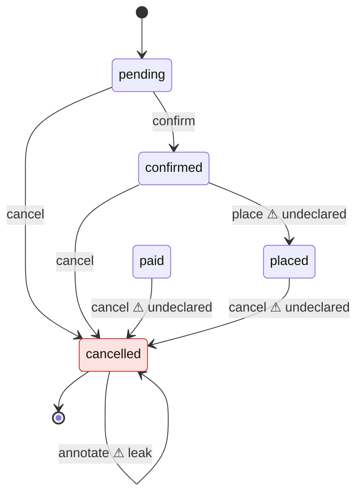

# domain-integrity

[](https://www.npmjs.com/package/domain-integrity)
[](https://github.com/mannkostir/domain-integrity/actions/workflows/ci.yml)
[](LICENSE)

**Your aggregates have lifecycles. Nothing checks them.**

Your tests pass and your types check, yet a closed account still accepts deposits and a cancelled order can still be edited. Lifecycle rules live in people's heads, and every new method, whether you or a coding agent wrote it, can quietly break one.

`domain-integrity` reads your aggregates with the TypeScript type checker. It works out which states each method can actually run from, compares that with a three-line declaration of what you intended, and fails CI where the two disagree.

## See it catch a bug

A typical aggregate. Once an account is closed, nothing should happen to it, but nothing enforces that:

```ts
import { AggregateRoot } from './aggregate-root';

export class Account extends AggregateRoot<{ balance: number }> {
  private closedAt: Date | null = null;
  private lockedAt: Date | null = null;

  static open(): Account {
    return new Account({ balance: 0 });
  }

  deposit(amount: number): void {
    if (amount < 1) throw new Error('Amount must be positive');
    this.props.balance += amount;
  }

  withdraw(amount: number): void {
    if (this.props.balance < amount) throw new Error('Insufficient funds');
    this.props.balance -= amount;
  }

  lock(): void {
    if (this.lockedAt) throw new Error('Already locked');
    this.lockedAt = new Date();
  }

  close(): void {
    if (this.props.balance > 0) throw new Error('Balance remains');
    this.closedAt = new Date();
  }
}
```

Write the rule down once:

```ts
import { defineDomain, lifecycle } from 'domain-integrity';
import { Account } from './src/account';

export default defineDomain({
  lifecycles: [lifecycle(Account, { states: { closedAt: { terminal: 'set' } } })],
});
```

Run `npx domain-integrity check`:

```text
error terminal-state-leak  Account.deposit()  src/account.ts:11
  deposit() can run after closedAt is 'set'.
  Fix: Guard deposit() so it cannot run when closedAt is 'set', or list it in allowAfterTerminal if that is intended.

error terminal-state-leak  Account.withdraw()  src/account.ts:16
  withdraw() can run after closedAt is 'set'.
  Fix: Guard withdraw() so it cannot run when closedAt is 'set', or list it in allowAfterTerminal if that is intended.

error terminal-state-leak  Account.lock()  src/account.ts:21
  lock() can run after closedAt is 'set'.
  Fix: Guard lock() so it cannot run when closedAt is 'set', or list it in allowAfterTerminal if that is intended.

error terminal-state-leak  Account.close()  src/account.ts:26
  close() can run after closedAt is 'set'.
  Fix: Guard close() so it cannot run when closedAt is 'set', or list it in allowAfterTerminal if that is intended.

4 errors, 0 warnings
```

Every method still runs on a closed account, including `close()` itself. The exit code is `1`, so CI fails.

## See the lifecycle

`npx domain-integrity show` draws each aggregate's real state machine as Mermaid, which renders directly on GitHub. Here is an `Order` whose declaration says `place` runs from `paid` and `cancel` runs only from `pending` or `confirmed`:



The picture shows four bugs:
- **`paid` is unreachable.** No code ever sets it.
- **`place` skips payment.** It runs straight from `confirmed`.
- **`cancel` runs too late.** It still works after the order is paid or placed.
- **`annotate` leaks past the end.** It still changes a cancelled order.

`check` reports each of them, with a fix.

## Quick start

```bash
npm i -D domain-integrity
npx domain-integrity init
npx domain-integrity check
```

`init` finds your aggregates and suggests their state fields and terminal values. It writes `domain.config.ts` with real imports, so renaming an enum member makes `check` fail instead of silently drifting. You review the suggestions once; after that, `check` runs on every commit.

**Requirements:** Node 20+, a TypeScript 5+ project, and `strictNullChecks` for nullable state fields.

## What it checks

| Check | Catches |
|---|---|
| `terminal-state-leak` | A public method that can still change the aggregate after it reached a terminal state |
| `unreachable-state` | A state your type declares but no code ever assigns |
| `outside-mutation` | State assigned from outside the aggregate, for example from a service, mapper or specification. A write through the aggregate's own setter is not one. |
| `transition-drift` | A method that can run from states you did not declare (error), or no longer from states you did (warning) |

Only public methods are judged. Private and protected helpers, such as event-sourcing appliers, are covered by the public command that calls them.

Every file your tsconfig includes is scanned, tests too, so an assignment in a test is reported as `outside-mutation`. To leave tests out, give `check` a tsconfig that excludes them:

```json
{
  "extends": "./tsconfig.json",
  "exclude": ["node_modules", "test", "**/*.spec.ts", "**/*.test.ts"]
}
```

```bash
npx domain-integrity check -p tsconfig.domain.json
```

## Commands

| Command | What it does |
|---|---|
| `init [--yes]` | Suggests and writes declarations. On an existing config it only adds new aggregates. |
| `check [--format text\|json\|sarif]` | Reports findings. Exit `0` clean, `1` findings, `2` config, project or usage error. |
| `show [Aggregate]` | Prints Mermaid state diagrams. |
| `context [--write AGENTS.md]` | Writes a lifecycle summary for coding agents. |

Every command takes `-p <tsconfig>` and `-c <config>`, which default to `tsconfig.json` and `domain.config.ts`. The config is read statically and never executed.

## Built for codebases that agents write

Agents produce code that passes tests and still breaks the domain. Give them the rules before they write:

```bash
npx domain-integrity context --write AGENTS.md
```

This writes each aggregate's states, terminal values and allowed transitions into a marked section of `AGENTS.md`, or `CLAUDE.md`, and leaves the rest of the file untouched. The agent reads the rules up front, and `check` catches whatever slips through.

## Adopt it in an existing codebase

You don't have to fix everything first. Record today's findings and fail only on new ones:

```bash
npx domain-integrity check --update-baseline
npx domain-integrity check --baseline domain-integrity.baseline.json
```

Baseline entries are keyed by check, aggregate, method and field, not by line number, so unrelated edits don't break the baseline.

## CI

```yaml
name: domain-integrity
on:
  push:
    branches: [main]
  pull_request:
permissions:
  contents: read
  security-events: write
jobs:
  lifecycles:
    runs-on: ubuntu-latest
    steps:
      - uses: actions/checkout@v4
      - uses: actions/setup-node@v4
        with:
          node-version: 20
      - run: npm ci
      - uses: mannkostir/domain-integrity@v0
        with:
          baseline: domain-integrity.baseline.json
```

Findings appear as code-scanning alerts on the pull request, and the job fails when `check` does.

| Input | Default | Meaning |
| --- | --- | --- |
| `project` | `tsconfig.json` | path to the project's `tsconfig.json` |
| `config` | `domain.config.ts` | path to the declaration |
| `baseline` | none | baseline file to apply |
| `upload` | `true` | upload the SARIF report to code scanning; set `false` when code scanning is unavailable |

The step exposes `exit-code`, the exit code of `check`, and `sarif-file`, the path to the SARIF report.

## The declaration

```ts
import { defineDomain, lifecycle } from 'domain-integrity';
import { OrderEntity } from './src/ordering/domain/order.entity';
import { OrderStatus } from './src/ordering/domain/order-status';
import { Account } from './src/accounts/domain/account';

export default defineDomain({
  aggregateBaseClasses: ['AggregateRoot'],
  lifecycles: [
    lifecycle(OrderEntity, {
      states: {
        status: {
          terminal: [OrderStatus.cancelled],
          transitions: {
            confirm: [OrderStatus.pending],
            cancel: [OrderStatus.pending, OrderStatus.confirmed],
          },
        },
      },
      allowAfterTerminal: ['remove'],
    }),
    lifecycle(Account, { states: { closedAt: { terminal: 'set' } } }),
  ],
});
```

| Option | Meaning |
|---|---|
| `states` | The aggregate's state fields. Supported: enum, string-literal union, boolean, and nullable (`T \| null` or optional; use `'set'` and `'unset'`). Name the data field itself, e.g. `_status` rather than its getter. |
| `terminal` | Required. The values after which the aggregate must not change. |
| `transitions` | Optional. The states each method may run from. Method names are type-checked; values are validated when `check` runs. |
| `allowAfterTerminal` | Methods allowed on a finished aggregate, such as `remove`. |
| `aggregateBaseClasses` | Base classes that mark an aggregate. Default: `['AggregateRoot', 'Entity']`. |
| `auditFields` | Fields `init` never suggests. Default: `['createdAt', 'updatedAt', 'version']`. |
| `eventMethods` | Calls that emit domain events. Default: `['addEvent', 'addDomainEvent', 'apply']`. |

## Quiet by design

A lint rule that cries wolf gets switched off. `domain-integrity` reports only what it can prove, and stays silent on code it cannot follow. In practice it says nothing about:

- **Guards it can't follow.** Examples are rule or policy objects, conditions on local copies of the state, and abstract or library methods. That method is skipped for that field.
- **Methods that hand out `this`.** That covers fluent `return this`, passing the aggregate to a constructor, and aliasing or destructuring it.
- **Object fields in aggregates that leak `this` anywhere.** Methods that read those fields are skipped, because a field might hold a callback into the aggregate.
- **Calls to library base-class methods**, other than the configured event methods, because library code can call back into your overrides. An allowlist is planned: [#9](https://github.com/mannkostir/domain-integrity/issues/9).
- **Values mentioned elsewhere.** `unreachable-state` stays quiet about a value that appears anywhere outside comparisons and types.
- **Writes through the aggregate's own setters.** `order.status = x` or `Object.assign(order, { status })` is not an outside mutation when `status` is a setter on the aggregate or one of its project base classes, because the setter is the aggregate's own code. A write through a setter declared only in library code is still reported as `outside-mutation`. The value still counts as assigned for `unreachable-state`. Setters themselves are not judged, so a setter without a guard goes unreported.
- **Database writes.** State changed by `UPDATE` statements or query builders is invisible.

A few rare self-wiring shapes can still produce a false finding; [#10](https://github.com/mannkostir/domain-integrity/issues/10) lists them. If it flags something that is not a bug, please [open an issue](https://github.com/mannkostir/domain-integrity/issues).

<details>
<summary>The precise rules</summary>

- **Guards.** A guard counts only if it is an early return or throw, or an `if` that wraps the whole method, with conditions built from `===`, `!==`, truthiness, `&&`, `||`, `!`, and getters that return such a condition. Any other read of the state field in the method makes its allowed sources unknown. Unknown never produces a finding.
- **Members without a body.** A member with no body in the project counts as reading the state field. That includes abstract members, members declared only in `.d.ts` files, and members of base classes that cannot be resolved. There are two exceptions:
  - configured `eventMethods`, which are assumed not to read it;
  - library data properties whose type is not callable and cannot hold the field. A `.d.ts` that declares a getter as a plain property is trusted as written.
- **`this` escapes.** A method that lets `this` or `this.props` escape is not judged. That covers aliasing, destructuring, passing as an argument, returning, and `this.props = { ...this.props }`.
- **Aggregates that leak `this`.** An aggregate leaks `this` when anywhere in its project base classes or subclasses either of these happens:
  - `this` or `this.props` escapes;
  - an arrow function captures `this`, other than as a direct callback of `filter`, `map`, `some`, `every`, `find`, `findIndex`, `forEach`, `reduce`, `flatMap` or `sort` on a built-in array.

  These do not count as leaks:
  - a discarded `Object.assign(this, …)`;
  - an object spread of `this` or `this.props`;
  - a static factory's plain `return v;`.

  Inside static members, locals and parameters typed as the aggregate are tracked like `this`. In a leaking aggregate, every non-primitive project field counts as reading the state field. In an aggregate that does not leak, project fields are plain data.
- **Unreachable values.** `unreachable-state` is skipped for a field if any of these holds:
  - the field has an assignment whose value cannot be resolved;
  - a method may write the field through an escaping `this`;
  - the value is mentioned anywhere outside comparisons and type positions.
- **Imports.** With `NodeNext` module resolution, add `.js` to the imports that `init` generates.

</details>

## Status

Early: version 0.x. The analysis is validated against nine public TypeScript DDD repositories. Known gaps and the roadmap, including an event and saga flow analyzer, are in the [issues](https://github.com/mannkostir/domain-integrity/issues).

## License

MIT
