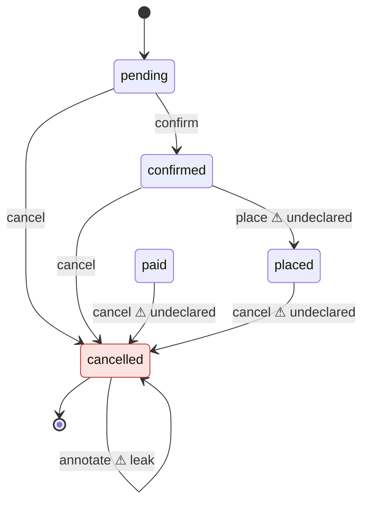

# domain-integrity

Your aggregates have lifecycles. Nothing checks them.

`domain-integrity` is a TypeScript CLI that reads your aggregates with the type checker, compares what the code actually allows against the lifecycle you declare, and reports the places where they disagree.

## The problem, in one example

An `Account` can be closed. Once closed, nothing should happen to it. But nobody wrote that down, so nothing stops this:

```ts
import { AggregateRoot } from './aggregate-root';

export class Account extends AggregateRoot<{ balance: number }> {
  private closedAt: Date | null = null;
  private lockedAt: Date | null = null;

  static open(): Account {
    return new Account({ balance: 0 });
  }

  deposit(amount: number): void {
    if (amount < 1) throw new Error('Amount must be positive');
    this.props.balance += amount;
  }

  withdraw(amount: number): void {
    if (this.props.balance < amount) throw new Error('Insufficient funds');
    this.props.balance -= amount;
  }

  lock(): void {
    if (this.lockedAt) throw new Error('Already locked');
    this.lockedAt = new Date();
  }

  close(): void {
    if (this.props.balance > 0) throw new Error('Balance remains');
    this.closedAt = new Date();
  }
}
```

Declare the intent: `closedAt` is the lifecycle field, and an account is finished once it is set.

```ts
import { defineDomain, lifecycle } from 'domain-integrity';
import { Account } from './src/account';

export default defineDomain({
  lifecycles: [lifecycle(Account, { states: { closedAt: { terminal: 'set' } } })],
});
```

Run `npx domain-integrity check`:

```text
error terminal-state-leak  Account.deposit()  src/account.ts:11
  deposit() can run after closedAt is 'set'.
  Fix: Guard deposit() so it cannot run when closedAt is 'set', or list it in allowAfterTerminal if that is intended.

error terminal-state-leak  Account.withdraw()  src/account.ts:16
  withdraw() can run after closedAt is 'set'.
  Fix: Guard withdraw() so it cannot run when closedAt is 'set', or list it in allowAfterTerminal if that is intended.

error terminal-state-leak  Account.lock()  src/account.ts:21
  lock() can run after closedAt is 'set'.
  Fix: Guard lock() so it cannot run when closedAt is 'set', or list it in allowAfterTerminal if that is intended.

error terminal-state-leak  Account.close()  src/account.ts:26
  close() can run after closedAt is 'set'.
  Fix: Guard close() so it cannot run when closedAt is 'set', or list it in allowAfterTerminal if that is intended.

4 errors, 0 warnings
```

Every method can still run on a closed account. The exit code is `1`.

## Diagram

`npx domain-integrity show` prints a Mermaid state diagram per aggregate, merging what the code does with what you declared. Drifted transitions and terminal-state leaks are styled distinctly. Here the red `cancelled` state is a leak: `annotate` still runs after the order is cancelled.



## Install and first run

```bash
npm i -D domain-integrity
npx domain-integrity init
npx domain-integrity check
```

`init` discovers aggregates, proposes state fields and terminal values, and writes `domain.config.ts` with real imports. It asks per aggregate in a TTY; pass `--yes` to accept every suggestion. On an existing config it only adds undeclared aggregates and never modifies existing declarations.

Exit codes: `0` no error-level findings, `1` error-level findings, `2` configuration, project or usage error. `domain.config.ts` is read statically and never executed.

## The declaration

```ts
import { defineDomain, lifecycle } from 'domain-integrity';
import { OrderEntity } from './src/ordering/domain/order.entity';
import { OrderStatus } from './src/ordering/domain/order-status';
import { Account } from './src/accounts/domain/account';

export default defineDomain({
  aggregateBaseClasses: ['AggregateRoot'],
  lifecycles: [
    lifecycle(OrderEntity, {
      states: {
        status: {
          terminal: [OrderStatus.cancelled],
          transitions: {
            confirm: [OrderStatus.pending],
            cancel: [OrderStatus.pending, OrderStatus.confirmed],
          },
        },
      },
      allowAfterTerminal: ['remove'],
    }),
    lifecycle(Account, { states: { closedAt: { terminal: 'set' } } }),
  ],
});
```

- `states`: one or more state fields of the aggregate. Each field is analysed independently. Supported types are enum, string-literal union, boolean, and nullable (`T | null` or optional). Name the data field itself: a field that exists only as a getter or setter is rejected, so declare its backing field (for example `_status`) instead.
- `terminal`: required per state field. The values after which the aggregate should do nothing. For nullable fields use `'set'` (non-null) or `'unset'`.
- `transitions`: optional. Maps a method name to the values it may run from. Keys are typed as the class's method names, values as the field's values.
- `allowAfterTerminal`: methods exempt from `terminal-state-leak`, such as a `remove` that is meant to run on a finished aggregate.
- `aggregateBaseClasses`: base classes that mark a class as an aggregate. Defaults to `['AggregateRoot', 'Entity']`.
- `auditFields`: fields excluded from `init` suggestions. Defaults to `['createdAt', 'updatedAt', 'version']`. Declaring a field in `states` overrides the exclusion.
- `eventMethods`: calls that count as emitting a domain event, and therefore as mutation. Defaults to `['addEvent', 'addDomainEvent', 'apply']`.

## Checks

| Id | Requires | Reports | Severity |
|---|---|---|---|
| `terminal-state-leak` | `terminal` | A public method that mutates and whose allowed sources for the field include a terminal value, unless listed in `allowAfterTerminal` | error |
| `unreachable-state` | enum or union state field | A value of the field that is never assigned anywhere (inside or outside the class) and is not the initial value set by a static factory or constructor | error |
| `outside-mutation` | state field | Any assignment to the state field from outside the aggregate class, detected through the type checker, including in specification and mapper classes | error |
| `transition-drift` | `transitions` | Code allows a source that is not declared | error |
| | | Code allows fewer sources than declared | warning |
| | | A public method sets the field but has no entry in the declared `transitions` | error |

`terminal-state-leak` and `transition-drift` judge only public methods. Private, protected and `#private` methods, such as event-sourcing appliers reached through `apply`, are left to the public command that calls them. Methods inherited from base classes in your project count as the aggregate's own, and a method the aggregate overrides is judged in its overriding form. Methods of the classes listed in `aggregateBaseClasses`, and of classes from libraries, are not judged.

Findings for a field whose allowed sources cannot be determined are suppressed for that method. Unknown never produces a finding.

Output formats: `--format text|json|sarif`.

## Existing codebases

Adopt it without fixing everything first. Record the current findings, then fail only on new ones:

```bash
npx domain-integrity check --update-baseline
npx domain-integrity check --baseline domain-integrity.baseline.json
```

`--update-baseline` writes `domain-integrity.baseline.json` unless you pass a path with `--baseline`. Findings are keyed by check id, aggregate, method and field, not by line number, so unrelated edits do not invalidate the baseline. Findings in the baseline are reported as known and do not affect the exit code.

## CI

```yaml
name: domain-integrity
on:
  push:
    branches: [main]
  pull_request:
permissions:
  contents: read
  security-events: write
jobs:
  lifecycles:
    runs-on: ubuntu-latest
    steps:
      - uses: actions/checkout@v4
      - uses: actions/setup-node@v4
        with:
          node-version: 20
      - run: npm ci
      - uses: mannkostir/domain-integrity@v0
        with:
          project: tsconfig.json
          config: domain.config.ts
          baseline: domain-integrity.baseline.json
```

The action uploads findings as SARIF, so they show up as code scanning alerts, and fails the job when `check` exits non-zero.

## Agents

```bash
npx domain-integrity context --write AGENTS.md
```

This writes a compact summary per aggregate (states, terminal values, allowed transitions) into a delimited section of `AGENTS.md`. Content outside the section is never touched. Agents read the lifecycle rules before writing code, so they stop adding methods that run on finished aggregates.

## What it does not see

The analyzer prefers silence to a wrong finding. These cases produce no finding:

- **Guards it cannot interpret.** If a guard on a state field cannot be interpreted, nothing is reported for that method and field. Examples are rule objects, policy objects, conditions built from local aliases, and calls to members whose body cannot be read, such as abstract methods, methods declared only in `.d.ts` files, and members of base classes that cannot be resolved. Any such member, and any other method or accessor without a body in the project, is treated as reading the state field, because library code can call back into methods the project overrides. The one exception is a data property declared in a library whose type is not callable and cannot hold the state field (not `any`, not the aggregate, without that field directly or under `props`, without a string index signature): data properties run no code. A function-typed property that is invoked counts as a read.
- **`this` escaping.** Any method that lets `this` or `this.props` escape is not judged. That includes aliasing, destructuring, passing `this` as an argument, returning `this`, and immutable updates such as `this.props = { ...this.props }`.
- **Fluent methods.** Methods that `return this`, or pass `this` along, are not judged, and are not asked to declare a transition.
- **Values that might be assigned elsewhere.** `unreachable-state` stays silent for any value that is mentioned anywhere in the analysed code outside comparisons and types, and for any field that has an assignment whose value cannot be resolved or that a method may write through an escaping `this`.
- **Event methods.** The analyzer assumes that the configured `eventMethods` (by default `addEvent`, `addDomainEvent` and `apply`) do not read the state field when their body is not in the project, and it does not judge the event handlers they dispatch to as guards.
- **Fields that may hold the aggregate.** If the aggregate leaks `this` anywhere in its project base classes or subclasses, by letting `this` or `this.props` escape (copying values with a discarded `Object.assign(this, …)` or an object spread of `this` or `this.props` does not count) or by an arrow function that references `this` other than a direct callback of `filter`, `map`, `some`, `every`, `find`, `findIndex`, `forEach`, `reduce`, `flatMap` or `sort` called on a built-in array or tuple, or by a static factory that lets a local variable or parameter typed as the aggregate escape or be captured by a closure (a plain `return v;` does not count), then every project field whose type is not primitive (string, number, boolean, bigint, symbol, literal, enum, or a built-in library type such as `Date`) is treated as reading the state field, and methods that read such fields are not judged. In an aggregate that does not leak `this`, project fields are treated as plain data whatever their type. Inside static members, only locals and parameters typed as the aggregate or a class in its family are tracked. A back-reference wired in any of these ways is not seen and can produce a false leak: from outside the class, such as `agg.policy = new Policy(agg)`; a static-member local typed through an interface the aggregate implements, typed `any`, typed as an intersection, or left untyped (`let o; o = new X()`); the instance held inside another object (`box.o.policy.owner = box.o`); wiring inside an instance-method factory such as `clone()`; and a module-level factory function. Data properties declared in a library count as reads when their type is callable, contains something callable, has an index signature or could hold the state field. A `.d.ts` file that declares a getter as a plain property is trusted as written and treated as data.
- **Direct database writes.** State changed by direct database writes, such as an `UPDATE` statement or a query builder, is invisible.

Project requirements:

- Projects using `NodeNext` module resolution must add `.js` to the imports that `init` generates.
- `strictNullChecks` is required for nullable state fields.
- TypeScript 6 users with deprecated tsconfig options are fine. Diagnostics outside `domain.config.ts` are ignored.

## License

MIT
